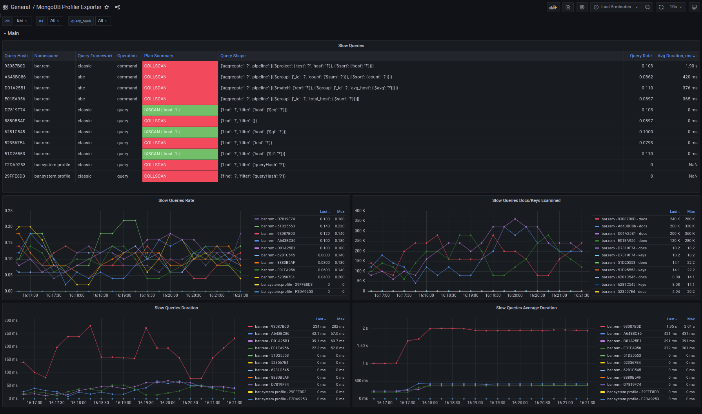

## MongoDB Profiler Exporter

A Python script that exports MongoDB slow query metrics from system.profile collection for Prometheus monitoring. [Read more](https://medium.com/@andriikrymus/mongodb-profiler-exporter-3abb84b877f1)

### Installation
```bash
pip install -r requirements.txt
python mongodb-profiler-exporter.py
```

### Docker
```js
docker run -p 9179:9179 -it --rm --name mongodb-profiler-exporter andriik/mongodb-profiler-exporter
docker run -it --rm --net host --name mongodb-profiler-exporter andriik/mongodb-profiler-exporter // host network
```

### Helm
```js
helm repo add mongodb-profiler-exporter https://andrii29.github.io/mongodb-profiler-exporter
helm repo update
helm search repo mongodb-profiler-exporter
helm show values mongodb-profiler-exporter/mongodb-profiler-exporter
helm install <release-name> -n <namespace-name> mongodb-profiler-exporter/mongodb-profiler-exporter
```

### Usage
```
usage: mongodb-profiler-exporter.py [-h] [--mongodb-uri MONGODB_URI] [--wait-interval WAIT_INTERVAL] [--max-string-size MAX_STRING_SIZE] [--listen-ip LISTEN_IP] [--listen-port LISTEN_PORT] [--verbose]

MongoDB Prometheus Exporter

options:
  -h, --help            show this help message and exit
  --mongodb-uri MONGODB_URI
                        MongoDB URI (default: mongodb://127.0.0.1:27017/)
  --wait-interval WAIT_INTERVAL
                        Wait interval between data parsing in seconds (default: 10)
  --max-string-size MAX_STRING_SIZE
                        Maximum string size for Prometheus labels (default: 1000)
  --listen-ip LISTEN_IP
                        IP address to listen on (default: 0.0.0.0)
  --listen-port LISTEN_PORT
                        Port to listen (default: 9179)
  --verbose VERBOSE     Enable Verbose Mode (default: False)

```

#### Environment Variables

You can use environment variables to configure the exporter. If an environment variable is set, it takes precedence over the corresponding command-line argument.

- `MONGODB_URI`: MongoDB URI (default: `mongodb://127.0.0.1:27017/`)
- `WAIT_INTERVAL`: Wait interval between data parsing in seconds (default: `10`)
- `MAX_STRING_SIZE`: Maximum string size for Prometheus labels (default: `1000`)
- `LISTEN_IP`: IP address to listen on (default: `0.0.0.0`)
- `LISTEN_PORT`: Port to listen (default: `9179`)
- `VERBOSE`: Enable verbose mode (default: `False`)

### Authentication
To set up authentication, follow these steps:
```
mongosh

use admin
db.createUser({
  user: "mongodb-profiler-exporter",
  pwd: passwordPrompt(),
  roles: [ { role: "clusterMonitor", db: "admin" } ]
})

python mongodb-profiler-exporter.py --mongodb-uri "mongodb://mongodb-profiler-exporter:<password>@127.0.0.1:27017/admin?authSource=admin&readPreference=primaryPreferred"
```

### Enable MongoDB Profiler
There are two ways to enable profiler in mongodb:
#### Per Dababase
```
use db_name
db.getProfilingStatus()
db.setProfilingLevel(1, { slowms: 100 })
```

#### Globally in mongod.conf
```yaml
operationProfiling:
  mode: slowOp
  slowOpThresholdMs: 100
```

### Increase system.profile size
The default size of the system.profile collection is set to 1MB, which can be insufficient for certain scenarios. To address this limitation, you can adjust the size of the collection by recreating it. Note that this process should not be replicated to replicas.

Below are example commands that can be used to increase the size of the system.profile collection to 50MB:
```js
db.setProfilingLevel(0) // Disable profiling temporarily
db.system.profile.drop() // Drop the existing system.profile collection
db.createCollection( "system.profile", { capped: true, size: 1024 * 1024 * 50 } )
db.setProfilingLevel(1, { slowms: 100 })  // Enable profiling again
```

### Replication and Sharding
Every MongoDB node has a separate `system.profile` collection, which does not replicate. Because of this, the MongoDB profiler exporter needs to be set up for every replica in every shard to get data from all instances, and the connection string should point to the local node, not the cluster.

### Supported MongoDB versions
```
4.4, 5.0, 6.0, 7.0, 8.0
```

### Exported Metrics

The exporter provides the following Prometheus metrics from MongoDB's `system.profile` collection:

#### Counter Metrics
| Metric Name | Type | Description |
|-------------|------|-------------|
| `slow_queries_count_total` | Counter | Total number of slow queries |
| `slow_queries_duration_total` | Counter | Total execution time of slow queries in milliseconds |
| `slow_queries_keys_examined_total` | Counter | Total number of examined keys |
| `slow_queries_docs_examined_total` | Counter | Total number of examined documents |
| `slow_queries_nreturned_total` | Counter | Total number of returned documents |

#### Gauge Metrics
| Metric Name | Type | Description |
|-------------|------|-------------|
| `slow_queries_info` | Gauge | Information about slow query (always set to 1) |

#### Labels Description
- **`db`**: Database name
- **`ns`**: Namespace (database.collection)
- **`query_hash`**: MongoDB's query hash identifier
- **`query_shape`**: Normalized query shape with sensitive data removed
- **`query_framework`**: Query framework used (e.g., "classic", "sbe")
- **`op`**: Operation type (e.g., "query", "update", "insert", "delete")
- **`plan_summary`**: Query execution plan summary

#### Example Metrics Output
```
# HELP slow_queries_count_total Total number of slow queries
# TYPE slow_queries_count_total counter
slow_queries_count_total{db="myapp",ns="myapp.users",query_hash="12345678"} 15

# HELP slow_queries_duration_total Total execution time of slow queries in milliseconds
# TYPE slow_queries_duration_total counter
slow_queries_duration_total{db="myapp",ns="myapp.users",query_hash="12345678"} 2500

# HELP slow_queries_info Information about slow query
# TYPE slow_queries_info gauge
slow_queries_info{db="myapp",ns="myapp.users",query_hash="12345678",query_shape="{find: ?, filter: {status: ?}}",query_framework="classic",op="query",plan_summary="IXSCAN { status: 1 }"} 1
```

### Grafana Dashboard
You can find example dashboard at id [20387](https://grafana.com/grafana/dashboards/20387)
